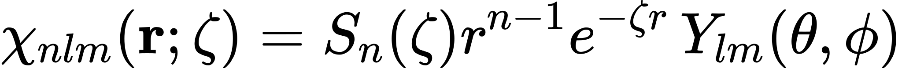
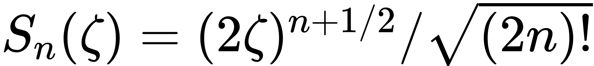
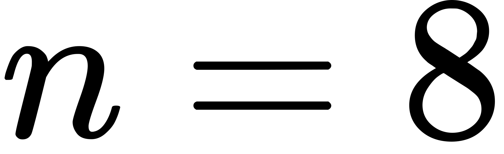
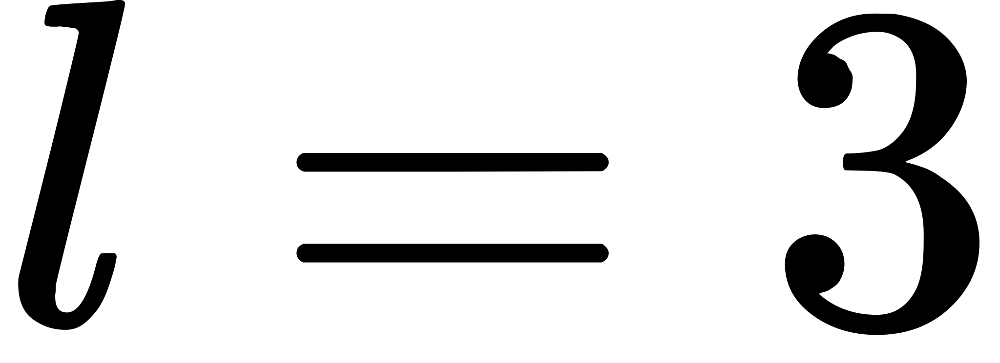
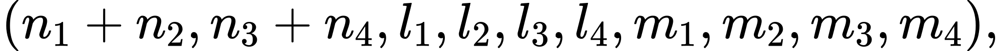

# libstoint

Computes atomic (one-center) 1- and 2-electron integrals over Slater-type orbitals, defined per [1] as

<!-- $$
\chi_{nlm}(\mathbf{r};\zeta)=S_n(\zeta)r^{n-1} e^{-\zeta r}\, Y_{lm}(\theta,\phi)
$$ --> 

where <!-- $S_n(\zeta)=(2\zeta)^{n+1/2} / \sqrt{(2n)!}$ -->  is a normalization constant.

The code has just started to work and is very immature.

### Capabilities

Currently, libstoint can calculate all one-center one-electron integrals--overlap, nuclear attraction, and kinetic energy--and all one-center two-electron integrals up to <!-- $n=8$ -->  and <!-- $l=3$ --> .

### Method

All one-electron integrals are formed as linear combinations of overlap integrals, see [2]. Expressions for the two-electron integrals are calculated in Mathematica using the general formula from [1] (supplementary info) and exported as C functions. Because there is one such expression for each value of
<!-- $$
(n_1 + n_2, n_3 + n_4, l_1, l_2, l_3, l_4, m_1, m_2, m_3, m_4),
$$ --> 

 they are accessed via a (n automatically generated) lookup table. Symmetry and selection rules cut the number of functions down, but there are still a lot. The combinatorial explosion means this method is not really appropriate for large <em>l</em>.

The inspiration for this approach was [3].

### Building
First, extract the ERI code by running `./extract.sh`, or (equivalently), `tar -xzf stoint/twoeints.tar.gz -C stoint/`. If you have a modern C/C++ compiler and a *nix operating system you may then run `make -j [jobs]; make tests`. For building and running the tests, you need GoogleTest. If you don't want to install it system-wide, you may modify the Makefile to use a local copy, or just not run the tests.

## References
[1] M. Lesiuk and R. Moszynski, Reexamination of the Calculation of Two-Center, Two-Electron Integrals over Slater-Type Orbitals. I. Coulomb and Hybrid Integrals, Phys. Rev. E 90, (2014).

[2] J. Fernández Rico, R. López, and G. Ramírez, Molecular Integrals with Slater Basis. I. General Approach, The Journal of Chemical Physics 91, 4204 (1989).

[3] S. Gümüş and T. Özdoǧan, Symbolic Calculation of Two-Center Overlap Integrals Over Slater-Type Orbitals, Jnl Chinese Chemical Soc 51, 243 (2004).